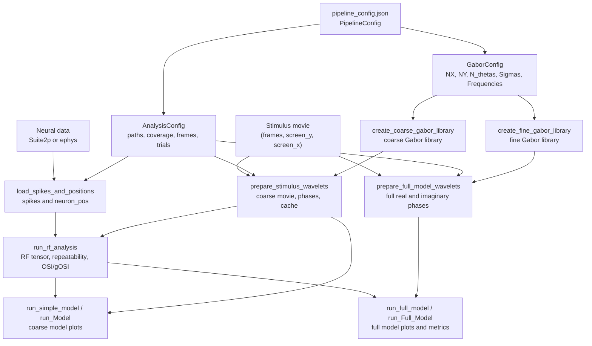

# Code mindmap

This page maps the main user-facing inputs to the functions that consume them
and the files or arrays they produce. It is meant as a bridge between the
tutorials and the generated API reference.

## End-to-end flow

## GUI scale selector

The GUI has one `Analysis scale` selector:

| Selected scale | Gabor button builds | Wavelet button writes | Model button runs |
| --- | --- | --- | --- |
| `coarse` | coarse coupled library | coarse downsampled movie, real/imaginary phases, durable RF cache | `run_Model` simple/coarse model plots |
| `full` | fine independent-frequency library | full-grid downsampled movie, full real/imaginary wavelets | `run_Full_Model` full model plots |

`Run Coarse RF Analysis` remains explicitly coarse because it finds the
preferred feature indices that both the coarse model and full model use as
starting structure.

## Function contracts

| Stage | Main function | Inputs | Outputs |
| --- | --- | --- | --- |
| configuration | `PipelineConfig.from_json()` | JSON path; optional `{PROJECT_ROOT}` placeholder | `PipelineConfig(gabor, analysis, workflow)` |
| coarse library | `create_coarse_gabor_library()` | `GaborConfig` | `*_coarse.npy` or `.zarr`; shape `(coarse_nx, coarse_ny, n_orientations, n_sigmas, n_phases, coarse_nx * coarse_ny)` |
| fine library | `create_fine_gabor_library()` | `GaborConfig`, `Sigmas Full Model` | `*_fine.npy` or `.zarr`; shape `(NX, NY, n_orientations, n_sigmas_total, n_frequencies, n_phases, NX * NY)` |
| coarse wavelets | `prepare_stimulus_wavelets()` or GUI coarse wavelet path | movie, coverage, coarse library | `dwt_downsampled_videodata.npy`; shape `(3, n_frames, coarse_nx, coarse_ny, n_orientations, n_sigmas)` |
| full wavelets | `prepare_full_model_wavelets()` or GUI full wavelet path | movie, coverage, fine library | `dwt_videodata2_r/i.npy` or `.zarr`; shape `(n_frames, NX, NY, n_orientations, n_sigmas, n_frequencies)` |
| alignment | `load_spikes_and_positions()` | acquisition files or `Spks Path` | `spikes` `(n_trials, n_frames, n_neurons)` and `neuron_pos` |
| RF analysis | `run_rf_analysis()` | `SpikeData`, coarse wavelet cache | RF tensor, preferred feature indices, repeatability, OSI/gOSI |
| model plots | `run_simple_model()` or `run_full_model()` | RF result, spikes, selected wavelets | predictions, parameters, metrics, figures |

## Mental model

The coarse path is the fast screening path. It reduces the grid, computes the
RF tensor, and gives interpretable retinotopy and tuning curves. The full path
is the expensive modeling path. It keeps the configured grid and frequency axis,
but it still relies on coarse RF analysis to decide which neurons and preferred
features are worth modeling.
