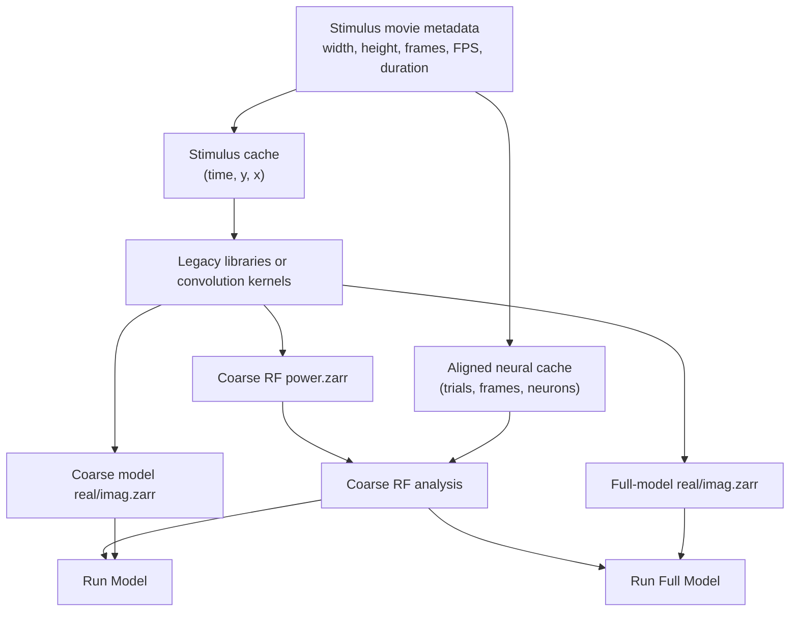

# Code and data flow

This page maps the current GUI workflow to the durable artifacts it creates.

## Artifact contracts

| GUI action | Input | Durable output | Consumer |
| --- | --- | --- | --- |
| Prepare Stimulus Cache | movie metadata + percentage | `(time, y, x)` binary movie | alignment, Gabor, wavelets |
| Create neural cache | raw neural data + movie frames/duration | `spikes`, `pos` | RF, OSI/gOSI, models |
| Prepare Gabor Assets | shared movie-derived grid | legacy libraries or convolution kernels | matching wavelet action |
| Prepare Coarse RF Power Cache | stimulus cache + coarse filters | `coarse_rf_power.zarr`, `(time, x, y, orientation, sigma)` | Coarse RF only |
| Prepare Run Model Phase Caches | stimulus cache + coarse filters | `coarse_model_real.zarr`, `coarse_model_imag.zarr` | Run Model only |
| Prepare Run Full Model Phase Caches | stimulus cache + fine filters | `dwt_videodata2_r.zarr`, `dwt_videodata2_i.zarr` | Run Full Model only |

The RF tensor is a correlation diagnostic. It chooses preferred features, but
OSI/gOSI are calculated from the aligned neural responses in `spikes`, using
wavelet energy only as a frame weight to form firing-rate orientation tuning.

## Dimension ownership

The movie owns width, height, frame count, FPS, and duration. The user owns one
downsampling percentage. The grid is derived as `round(width * percentage /
100)` by `round(height * percentage / 100)`. Consequently, no GUI input can
silently give a library, stimulus cache, RF tensor, or model product a different
spatial meaning.
