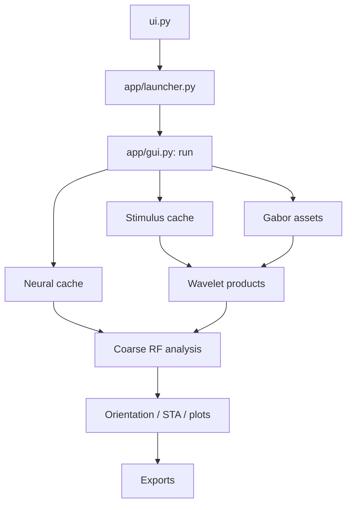

# Trace one analysis from click to result

This is the recommended reading order for a scientist or developer who wants
to follow one Waven analysis without getting lost in implementation detail.
Follow the **GUI route** for the application used in the lab, or begin at
`pipeline.py` for a script/notebook.

## The GUI route, in execution order

1. **Startup and configuration**

   Start at `ui.py`. It is intentionally a small error boundary.
   It calls `app/launcher.py:launch_from_project`, which reads
   `pipeline_config.json` with `load_launch_settings`. Continue to
   `config.py` for the typed `PipelineConfig`, `AnalysisConfig`, and
   `GaborConfig` contracts. `project_layout.py` defines the conventional
   project folders and artifact discovery rules.

2. **GUI orchestration, not numerical work**

   Open `app/gui.py:run`. This is the composition root: it creates controls,
   validates stage prerequisites, starts cancellable tasks, and turns results
   into figures/exports. Its three support files are useful before reading a
   callback:

   - `app/constants.py` — labels, hints, browse rules, and export notes;
   - `app/dependencies.py` — lazy bundles for plotting, Gabor, wavelet, RF,
     and model dependencies;
   - `app/telemetry.py` — safe terminal redirection and periodic CPU/GPU/disk
     task metrics.

   The important action callbacks appear in the same order as their GUI
   buttons: `create_downsampled_video_cache`, `create_neural_cache`,
   `create_selected_gabor_library`/`create_gabor`, `run_wavelet`, and
   `plot_data`.

3. **Stimulus geometry and cache**

   From `create_downsampled_video_cache`, read
   `stimulus/metadata.py` first. It reads video metadata, converts visual
   coverage to crop bounds, and derives a square-visual-degree analysis grid.
   Next read `wavelets/decomposition.py:downsample_video_binary`, which crops,
   resizes, and writes the disk-backed `(frames, y, x)` stimulus cache.
   `storage/array_store.py` and `storage/binary_movie.py` define how that
   cache remains memory-safe when later consumers read it.

4. **Neural alignment and cache**

   From `create_neural_cache`, follow `time_alignment.py:load_aligned_spikes`.
   It chooses the two-photon or EPHYS adapter. The normalized persistence
   boundary is `storage/neural_cache.py`; its output is always an aligned
   `spikes` array shaped `(trials, frames, neurons)`, a matching `pos` array,
   and—when available—EPHYS unit metadata. For raw-data details continue into
   `data/neural.py`, then the relevant `suite2p/` or `suite_ephys/` adapter.

5. **Gabor assets**

   From `create_gabor` or `_ensure_convolution_kernel_cache`, read
   `wavelets/filters.py`. It defines the Gabor bank. The convolution path then
   reads `wavelets/decomposition.py:build_convolution_kernel_cache`; legacy
   library generation remains in the same `filters.py` module for compatibility.
   Keep visual-angle geometry from step 3 in mind: GUI values are converted to
   physical cpd/degree values at the analysis boundary.

6. **Wavelet products**

   From `run_wavelet`, stay in `wavelets/decomposition.py`:

   - `waveletPowerDecompositionConv` writes the Coarse-RF power Zarr cache;
   - `waveletDecompositionConv` writes real/imaginary coarse phase caches;
   - `waveletDecompositionFullConv` writes full-model phases.

   Read the helpers at the top of that file first: execution planning,
   resumable-Zarr handling, capacity guards, kernel cache handling, then the
   public writer selected by the button. `runtime/performance.py` owns the
   CPU/GPU policy and `storage/wavelet_zarr.py` owns NPY-to-Zarr conversion.

7. **Coarse RF analysis and tuning**

   From `plot_data`, follow `analysis/receptive_fields.py: PearsonCorrelationPinkNoise`
   for the established GUI API, then read its bounded implementation in
   `analysis/rf_correlation.py`. It consumes the power cache plus trial-mean
   neural response and produces the RF tensor / preferred feature indices.
   Continue in this order:

   - `analysis/tuning.py` — validated RF-axis slices;
   - `analysis/orientation_selectivity.py` — firing-rate and correlation
     orientation curves, OSI/gOSI, selected-feature cache;
   - `analysis/psth_sta.py` — PSTH-weighted STAs;
   - `analysis/trial_stats.py` — repeatability and response-quality summaries.

8. **Models, figures, and export**

   `analysis/model_runs.py` coordinates model-level calls, while
   `analysis/nonlinear_models.py` owns the lower-level fitting logic. Return to
   `app/gui.py` for figure construction and export callbacks. The filtering and
   file-selection rules are in `gui_support/export_selection.py`; storage and
   metadata serialization remain near the GUI because they describe the exact
   plots currently displayed.

## The script/notebook route

Start in `pipeline.py`, not in `app/gui.py`:

1. `PipelineConfig.from_json` or `from_mappings` in `config.py`;
2. `create_coarse_gabor_library` / `create_fine_gabor_library`;
3. `prepare_stimulus_wavelets` / `prepare_full_model_wavelets`;
4. `load_spikes_and_positions`;
5. `run_rf_analysis`;
6. `run_simple_model` and/or `run_full_model`.

`pipeline.py` is a typed, scriptable façade. It calls the same domain modules
as the GUI but does not require Tkinter or embed figures.

## Reading rules that prevent false conclusions

- Follow array shape and unit comments at every boundary; the time, spatial,
  orientation, sigma, and frequency axes are part of the API.
- Treat `Analysis_Utils.py`, `LoadPinkNoise.py`, `WaveletGenerator.py`, and
  `zebraGUI.py` as compatibility shims. They explain old notebooks, but new
  work should start in the focused package listed above.
- Keep a disk-backed array disk-backed. `storage.load_array(..., mmap_mode="r")`
  and Zarr slicing are deliberate; a whole-array `np.asarray` can invalidate a
  run's RAM plan.
