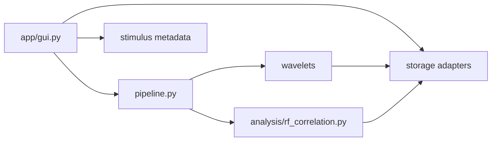

# Code organization and maintenance guide

`waven` separates the scientific pipeline from user-interface orchestration.
The separation matters because arrays can be many gigabytes: a small UI change
must not accidentally turn a disk-backed operation into a full-memory copy.

## Module ownership

| Area | Primary modules | Responsibility |
| --- | --- | --- |
| GUI | `app/gui.py` | Widget construction, user-visible progress, and sequencing actions. It should delegate scientific work rather than implement it. |
| Pipeline | `pipeline.py` | Scriptable high-level workflow with typed result containers. |
| Stimulus | `stimulus/metadata.py` | Authoritative video metadata, derived grid geometry, and coverage ratios. |
| Wavelets | `wavelets/decomposition.py` | Legacy and convolution wavelet generation, chunking, and cache writing. |
| Storage | `storage/array_store.py`, `storage/binary_movie.py`, `storage/neural_cache.py` | NPY/Zarr opening, safe disk-backed views, and neural-cache persistence. |
| RF correlation | `analysis/rf_correlation.py` | Bounded-memory correlation of disk-backed wavelets and neural responses. |
| Legacy analysis | `analysis/receptive_fields.py` | Existing public RF, plotting, prediction, and signal-analysis API. |

## Dependency direction

The GUI may know about actions and paths, but numerical modules must not import
GUI code. Storage modules must not import analysis or GUI code.

## Array safety contract

- Use `storage.load_array(..., mmap_mode="r")` for large NPY inputs.
- Use Zarr directly as a disk-backed array; do not call `np.asarray` on the
  complete store.
- Use `SignedBinaryMovie` when convolution needs a `{-1, 1}` view of a binary
  disk-backed movie.
- Use `streaming_cross_correlation` for RF correlations. It reads feature
  tiles, never `reshape(time, -1)` on a whole Zarr tensor.
- Before creating an unavoidable dense result, use the runtime memory guard and
  raise a clear, actionable error rather than letting the operating system run
  out of memory.

## Safe editing rules

1. Keep user-facing behavior in `app/gui.py`; place reusable non-widget logic
   in the owning domain module.
2. Preserve compatibility imports when moving a public legacy function. The
   old module can delegate to the new focused module.
3. Treat array shape as part of an artifact contract. Validate time, x, y,
   orientation, sigma, and frequency axes at module boundaries.
4. Add a focused test or smoke check whenever a cache layout, dimension rule,
   or loading policy changes.
5. Prefer a small new module with one responsibility over another large helper
   block inside `gui.py` or `receptive_fields.py`.

## Current refactoring boundary

The GUI remains the orchestration entry point for backwards compatibility. New
work should not add more numerical algorithms or file-format handling there.
Instead, add focused functions to `stimulus`, `storage`, `wavelets`, or
`analysis`, then call them from the relevant GUI action.
