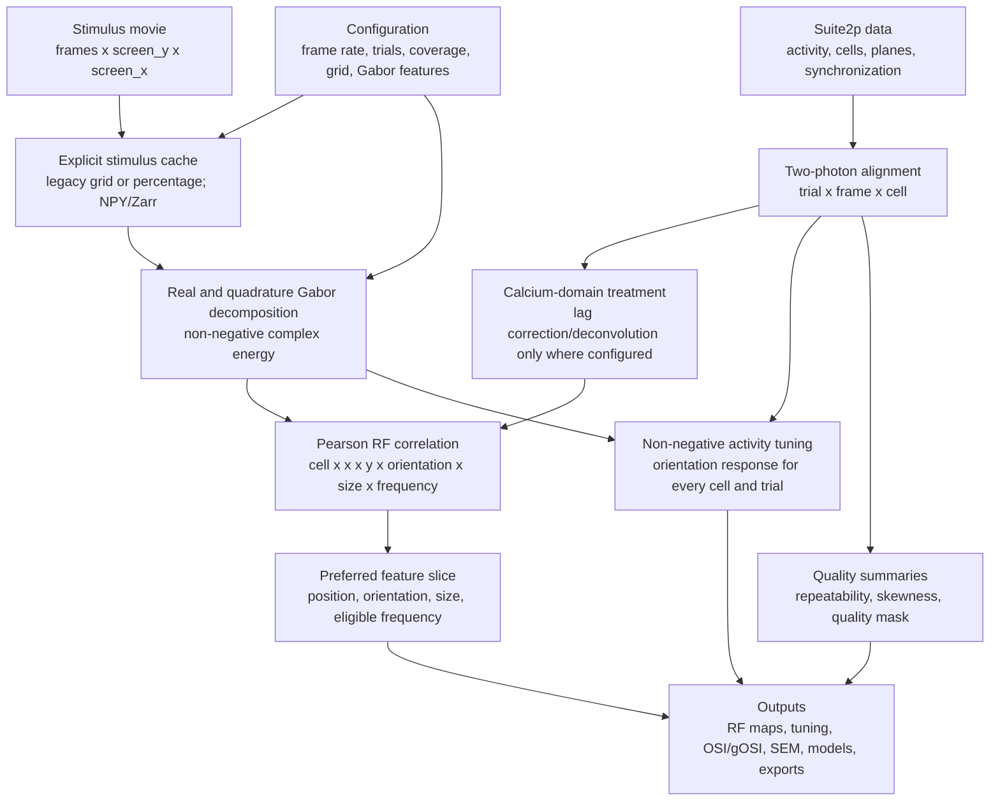

# Two-photon pipeline mindmap

This map emphasizes scientific inputs, transformations, outputs, and assumptions.

## Input contracts

| Input | Shape or unit | Meaning |
| --- | --- | --- |
| movie | decoded as `(n_frames, screen_y, screen_x)` | Visual drive before spatial cropping and resampling. |
| aligned activity | `(n_trials, n_frames, n_cells)` | One frame-aligned response per cell and repeat. |
| visual/analysis coverage | four bounds in visual degrees | Maps pixels and the selected crop into azimuth/elevation. |
| orientations | degrees modulo 180 | Orientation, not direction; 0 and 180 are equivalent. |
| sizes | configured pixels, converted to visual degrees for plots | Gabor envelope scale. |
| frequencies | cycles per degree | Spatial cycles represented by each filter. |
| phases | radians | Real/quadrature carrier phase. |

## Scientific sequence

1. The user explicitly creates a stimulus cache. `legacy` uses the established
   coarse grid for coarse analysis and the configured grid for full analysis;
   percentage mode scales both spatial dimensions. Either mode writes NPY or
   Zarr. Wavelet decomposition does not silently repeat this stage.
2. Gabor projection produces real and imaginary responses. Their magnitude is
   non-negative complex energy; phase components remain available to models that
   require phase.
3. Suite2p activity and synchronization are aligned to movie frames and repeats.
   Calcium-response lag treatment and deconvolution belong only to this branch.
4. Pearson correlation compares trial-averaged activity with candidate wavelet
   features. Correlation may be negative and is used to locate preferred RF
   features, not as the response supplied to OSI/gOSI.
5. At the preferred position, size, and frequency, wavelet energy weights the
   non-negative aligned response to form an orientation tuning curve. OSI uses
   preferred versus orthogonal response; gOSI uses all bins in a doubled-angle
   vector sum.
6. The same tuning calculation is retained for each trial. When `n_trials > 1`,
   SEM at each orientation is the sample standard deviation divided by
   `sqrt(n_trials)`.
7. Spatial-frequency tuning is displayed only when decomposition produced more
   than one genuine frequency bin.

## Assumptions

- Neural and movie clocks can be aligned without unresolved drift.
- Trials are comparable repeats of the same stimulus and preprocessing.
- Coverage bounds accurately describe the displayed visual field.
- Suite2p activity is a usable non-negative response proxy after chosen
  calcium-domain processing.
- Pearson correlation indicates association, not causality or firing rate.
- SEM quantifies repeat-to-repeat uncertainty within this recording, not
  between-session or between-animal uncertainty.
- Repeatability/skewness thresholds are quality screens, not significance tests.
- A cell identifier is local to the loaded recording unless another system
  establishes cross-session identity.

## Outputs

Outputs include aligned `spikes` and `pos`, stimulus and wavelet caches, RF
correlations, preferred-feature indices, trial orientation curves, OSI/gOSI,
SEM, quality summaries, model predictions/metrics, PNG/SVG figures, and NPY or
Zarr reusable export arrays.
