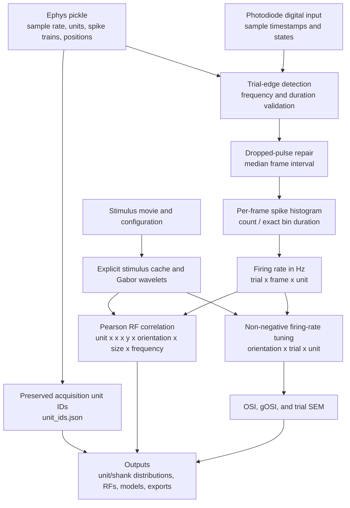

# Electrophysiology pipeline mindmap

This map follows extracellular events to firing-rate receptive fields. Actual
unit keys from the pickle are preserved and used as OSI/gOSI unit labels.

## Input contracts

| Input | Shape or unit | Meaning |
| --- | --- | --- |
| sampling frequency | samples per second | Converts acquisition-sample intervals to seconds. |
| unit spike train | one timestamp vector per pickle unit key | Extracellular event times in the acquisition clock. |
| unit position | up to three numeric coordinates | Physical/electrode position; discrete metadata may identify shanks. |
| photodiode stream | timestamps plus binary/state values | Observed display transitions used to define frame bins. |
| movie/Gabor inputs | same visual units as the 2p path | Candidate frame-wise visual features. |

## Scientific sequence

1. Photodiode transitions define candidate frame edges. Candidate trial spans
   are checked against expected duration before use.
2. Missing pulses are inserted using the median observed frame interval until a
   trial has `n_frames + 1` edges. This is a repair for isolated missing events,
   not a correction for an incorrect or drifting clock.
3. Each unit's spikes are histogrammed between consecutive frame edges. Counts
   are divided by each measured bin duration in seconds, producing firing rate
   in Hz. A tiny guard prevents division by an exactly zero interval.
4. Cortical-response-lag correction and calcium deconvolution are skipped. Ephys
   already records event timing and does not have a calcium indicator kernel.
5. Pearson RF correlation locates preferred visual features. The correlation
   values may be negative and are never passed blindly to OSI/gOSI.
6. Non-negative firing rate is weighted by wavelet energy at the preferred RF
   slice to form per-trial orientation tuning. Those trials provide SEM.
7. The pickle `units` mapping keys are written to `unit_ids.json` and label the
   by-unit histograms. Older caches without this metadata use an explicitly
   reported fallback. Shank grouping remains position-derived unless explicit
   shank metadata is present.
8. Spatial-frequency tuning is shown only when more than one frequency was
   actually decomposed.

## Assumptions

- Spike, digital-input, and metadata sample rates share one acquisition clock.
- The selected digital input is the photodiode channel and its transitions map
  to displayed frame boundaries.
- GUI frame count and trial duration describe the recorded stimulus.
- Frame binning intentionally discards sub-frame timing for RF correlation.
- Trials are exchangeable repeats for the purpose of mean and SEM.
- Unit IDs are stable inside this acquisition; they are not automatically
  biological identities across sessions.
- Position-derived shanks are valid only when the relevant metadata column is
  discrete and correctly encoded.
- Correlation is descriptive association, and the quality mask is not a
  hypothesis test.

## Outputs

Alignment writes `spikes.npy`/`.zarr`, `pos.npy`/`.zarr`, and `unit_ids.json`.
Analysis adds RF correlations, preferred features, repeatability, skewness,
firing-rate orientation tuning, OSI/gOSI, SEM, model artifacts, figures, and
reusable NPY/Zarr export arrays.
