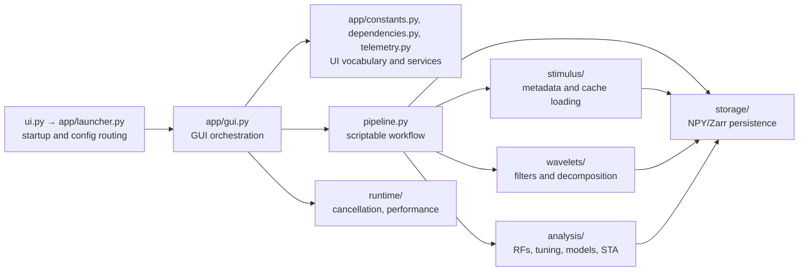

# Source architecture and ownership

This page is the maintenance map for `src/waven`. It describes where new work
belongs, which modules form the supported workflow surface, and which files are
compatibility layers. It documents the current layout without changing runtime
behaviour.

## Dependency rule

Numerical and storage modules must never import the GUI. The GUI owns widgets,
user-facing progress, and sequencing; it calls the domain modules rather than
reimplementing scientific calculations.

## Package map

| Location | Owns | Main entry points | Inputs | Outputs |
| --- | --- | --- | --- | --- |
| `config.py` | typed configuration and parsing | `PipelineConfig`, `AnalysisConfig`, `GaborConfig` | mappings, text fields, paths, numeric lists | validated immutable-style configuration objects and derived grid settings |
| `project_layout.py` | project-folder contract and artifact discovery | `WavenProjectLayout`, `find_stimulus_movie`, `conventional_*_path` | project root and folders | deterministic input/cache/output paths |
| `pipeline.py` | supported scriptable workflow | `run_pipeline`, `run_rf_analysis`, `prepare_*`, `run_*_model` | typed configs, disk-backed arrays, aligned neural data | result dataclasses and persisted cache paths |
| `app/launcher.py` | configuration-file startup boundary | `load_launch_settings`, `launch_from_project` | project root and optional `pipeline_config.json` | normalized GUI defaults without importing Tk |
| `app/gui.py` | GUI entry point and task orchestration | `run` | optional GUI defaults/configuration | CustomTkinter application; plots and export actions |
| `app/constants.py`, `app/dependencies.py`, `app/telemetry.py` | presentation vocabulary, lazy optional imports, terminal/resource services | static maps, `load_*`, `RedirectText`, `TaskResourceMonitor` | GUI action requirements and task lifecycle | reusable app infrastructure with no scientific calculations |
| `stimulus/` | movie metadata and wavelet-cache loading | `read_movie_metadata`, `downsampled_grid_dimensions`, `load_wavelets` | movie path, coverage, cache folders | authoritative metadata, crop bounds, disk-backed wavelet arrays |
| `wavelets/` | Gabor filter construction and chunked decomposition | `makeFilterLibrary*`, `downsample_video_binary`, `waveletDecomposition*` | movie/cache, Gabor axes, backend choice | boolean movie cache, kernel cache, phase/power Zarr arrays |
| `analysis/` | scientific calculations | `streaming_cross_correlation`, selectivity, tuning, STA, model runs | aligned responses plus wavelet features | RF tensors, tuning curves, selectivity, model fits, STA maps |
| `storage/` | NPY/Zarr persistence and memory-safe reads | `load_array`, `find_neural_cache_pair`, `save_aligned_neural_cache` | array path/folder and requested format | memory-mapped NPY or Zarr arrays, validated neural pairs |
| `runtime/` | cancellation, timing, RAM/CPU/GPU policies | `check_cancelled`, `OperationTelemetry`, `resolve_compute_device` | runtime flags and available hardware | bounded chunks, device selection, progress telemetry |
| `gui_support/` | GUI-pure helper rules | export classifiers and filename helpers | graph metadata and strings | export selection and portable paths |
| `data/`, `suite2p/`, `suite_ephys/` | acquisition-specific loading adapters | loader and timing utilities | raw experiment files | data later normalized to the neural-cache contract |

## Supported public surfaces

Use these surfaces for new scripts and features.

| Need | Use | Why |
| --- | --- | --- |
| Parse user/config-file values | `PipelineConfig.from_mapping` and the constituent config dataclasses | validates paths, types, axes, and defaults in one place |
| Locate project artifacts | `WavenProjectLayout` and `project_layout.py` helpers | keeps GUI and scripts on the same folder contract |
| Read movie geometry | `stimulus.metadata.read_movie_metadata` | movie metadata—not manually entered dimensions—is authoritative |
| Prepare analysis inputs | `pipeline.prepare_stimulus_wavelets`, `pipeline.prepare_full_model_wavelets` | keeps cache names, formats, and dimensional checks consistent |
| Run RF/model analyses | `pipeline.run_rf_analysis`, `pipeline.run_simple_model`, `pipeline.run_full_model` | supplies typed results and common frame-axis validation |
| Compute an STA | `analysis.psth_sta.compute_psth_sta` or `compute_psth_sta_batch` | standard PSTH-weighted STA with a strict 300-ms lag cap |
| Load/save big arrays | `storage.load_array`, `storage.neural_cache` helpers | preserves memory mapping and Zarr-backed access |

## Analysis module boundaries

| Module | Scientific responsibility | Return type/meaning |
| --- | --- | --- |
| `rf_correlation.py` | tile-wise Pearson correlation of stimulus features and neural responses | RF correlations without materializing a full feature matrix |
| `tuning.py` | direct, validated slices through one neuron's preferred RF tensor | spatial, orientation, size, and frequency tuning arrays |
| `orientation_selectivity.py` | OSI/gOSI from non-negative firing-rate orientation tuning | scalar selectivity per neuron plus tuning diagnostics |
| `psth_sta.py` | rate-weighted average of preceding stimulus frames | one 2-D map per lag and pixel-variance peak selection |
| `trial_stats.py` | response repeatability and quality statistics | trial-level and population diagnostics |
| `model_runs.py` | orchestration of the two nonlinear model paths | predictions, fitted parameters, metrics, and plots |
| `nonlinear_models.py` | lower-level model, fitting, interpolation, and signal functions | numerical primitives used by model runs and legacy callers |
| `receptive_fields.py` | legacy public RF/prediction utilities | compatibility scientific API; prefer focused modules for new code |

## Storage and lifecycle ownership

| Artifact | Writer | Reader | Invariant |
| --- | --- | --- | --- |
| movie metadata | `stimulus.metadata` | GUI, pipeline, alignment | positive width, height, frame count, and FPS |
| downsampled movie | `wavelets.decomposition.downsample_video_binary` | wavelet preparation, STA | `(frames, y, x)`, boolean, 1–100% grid setting |
| neural cache | `storage.neural_cache` / time alignment | RF, STA, models | spikes `(trials, frames, neurons)` and positions `(neurons, 2|3)` |
| Gabor assets | `wavelets.filters` / convolution kernel builder | wavelet decomposition | exact axes and grid fingerprint |
| wavelet products | `wavelets.decomposition` | RF/model pipeline | chunked Zarr, feature-order spatial axes `(x, y)` |
| exported graphs | GUI export layer | external analysis software | PNG/SVG plus data pickle, arrays, and JSON manifest |

## Historical compatibility modules

`Analysis_Utils.py`, `LoadPinkNoise.py`, `WaveletGenerator.py`, `zebraGUI.py`,
`gui.py`, `performance.py`, `power.py`, `task_control.py`, and `wavelet_io.py`
preserve established import paths. They should remain thin compatibility or
delegation layers. New domain code belongs in the focused packages above; new
GUI callbacks belong in `app/gui.py` only when they genuinely require widgets.

## Safe change checklist

1. Put reusable non-widget code in its scientific/storage/runtime owner.
2. Preserve the array contract at every boundary: time axis, spatial order,
   dtype, units, and trial/neuron axes.
3. Do not turn a disk-backed cache into `np.asarray(...)` unless the result is
   intentionally small and bounded.
4. Carry cancellation checks and recovery metadata through long writers.
5. Add a focused regression test for geometry, cache compatibility, shape, or
   numerical semantics.
6. Update [Data contracts and scientific interpretation](data-contracts.md)
   when a user-visible input or output changes.
