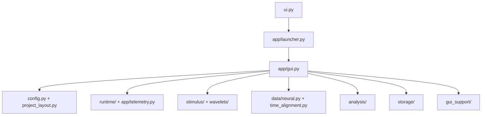

# Source architecture and ownership

This page is the maintenance map for the current application. The supported
interactive workflow is the convolution-only GUI launched by `ui.py`.

| Area | Primary files | Owns | Do not use it for |
| --- | --- | --- | --- |
| GUI startup | `ui.py`, `app/launcher.py` | Repository-root launch, optional config loading, user-facing startup errors. | Scientific computations or widget construction. |
| GUI interaction | `app/gui.py`, `app/constants.py` | Widget construction, staged actions, UI-thread scheduling, configuration save/load, export orchestration. | Reimplementing core numerical kernels. |
| Lazy dependency boundary | `app/dependencies.py` | Importing expensive wavelet/RF/model operations only when an action needs them. | Business logic or cache contracts. |
| Configuration/layout | `config.py`, `project_layout.py` | Typed configuration parsing, defaults, portable folder conventions, path references. | Tk widget state. |
| Runtime control | `runtime/`, `app/telemetry.py` | Cancellation, progress, resource monitoring, keep-awake behavior. | Persistent scientific results. |
| Stimulus planning | `stimulus/` | Movie metadata, visual-angle sampling plan, wavelet-cache validation. | Neural alignment. |
| Wavelet computation | `wavelets/` | Gabor filter construction, convolution kernels, chunked Coarse RF/full phase products. | GUI controls or export layout. |
| Neural alignment | `data/neural.py`, `time_alignment.py`, `suite2p/`, `suite_ephys/` | Fresh 2-photon/ephys ingestion, alignment, neural cache creation. | Wavelet products. |
| Analysis | `analysis/` | RF correlation, model runs, selectivity, STA, tuning, numerical helpers. | Direct Tk calls. |
| Storage | `storage/` | NPY/Zarr opening/writing, memory-safe views, neural cache discovery. | Plot styling or sampling decisions. |
| GUI helpers | `gui_support/` | Export graph classification, safe filenames, shared GUI helpers. | Core science. |

## Supported versus compatibility code

The active GUI creates and consumes convolutional kernel/power/phase caches.
The root-level compatibility wrappers (`zebraGUI.py`, `WaveletGenerator.py`,
`LoadPinkNoise.py`, `Analysis_Utils.py`) and the scripted `pipeline.py` remain
available for existing programmatic consumers. They are not the supported
onboarding route and should not be used to add a second GUI backend. New GUI
work belongs in the ownership boundaries above.

## Dependency rules

1. Keep Tk reads and writes on the UI thread. Background tasks receive an
   immutable snapshot of field/variable values.
2. Keep durable array format and provenance rules in `storage/`, `stimulus/`,
   or the producing numerical module—not in a button callback.
3. Keep cancellation checks in long loops/chunks within analysis, wavelet, and
   neural modules. The GUI only requests cancellation and reports the result.
4. Add a new user-facing setting in three places together: GUI creation,
   `pipeline_config.json` save/load, and the configuration documentation.
5. Prefer a focused module for new pure computation. Do not grow `app/gui.py`
   with numerical algorithms that can be tested independently.

See the [Maintainability Guide](../explanation/maintainability.md) for the
practical change and validation checklist.
