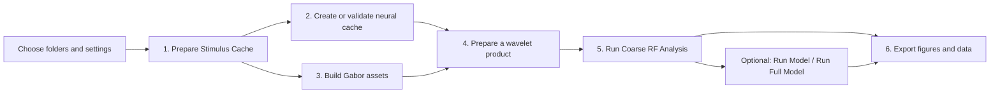

# First GUI analysis

This is the first-run path for Waven. The GUI is a staged pipeline: every completed stage creates a durable input for a later stage. Start at the top and use the status message to see the next available action.

## The story of one analysis



After the stimulus cache exists, you may prepare neural, Gabor, and wavelet inputs in a different order. Coarse RF analysis needs both a matching neural cache and the Coarse RF wavelet product.

## Before launching

From the repository root, activate the Waven environment and launch the GUI:

```bash
conda activate waven
python ui.py
```

The configuration file is optional. Fill fields in the GUI for a first run, then use **Save Current GUI Inputs / Parameters** when the choices work. [Prepare configuration](../how-to/prepare-configuration.md) documents the reusable JSON form.

### Input checklist

| Input | Type | Required? | What to provide |
| --- | --- | --- | --- |
| Project Root | writable folder | Yes | Folder that owns the Waven `input`, `cache`, and `output` tree. |
| Movie Path | folder containing one supported movie | Yes | Visual stimulus movie; Waven reads its dimensions, FPS, frames, and duration. |
| Visual Coverage | four-number list | Yes | `[left, right, top, bottom]` visual degrees for the original movie. |
| Analysis Coverage | four-number list | Yes | Crop to analyze, in the same order and inside Visual Coverage. |
| Raw Data Folder (`Dir`) | folder | For fresh neural alignment | Raw two-photon/ephys data, or its Waven reference folder. |
| Spks Path | folder | Only for Continue / existing cache | Existing compatible `spikes` and `pos` pair. |
| Completed Suite2p output | folder | Fresh 2-photon only | Completed `suite2p/planeN` results, not raw TIFFs. |
| Sampling Rate | positive number in Hz | Ephys only | Acquisition rate, for example `30000`. |
| Photodiode Port | selected integer | Ephys only | Trodes digital input carrying the photodiode/TTL signal. |

The conventional project tree is:

```text
your_experiment/
  input/raw_data/             raw source or a .waven_reference.json pointer
  input/stimulus_movie/       one movie file
  input/neural_cache/         spikes.npy/.zarr and pos.npy/.zarr
  cache/gabor/                Gabor libraries or convolution kernels
  cache/wavelets/             coarse and full-model products
  output/plots/               plot cache
  output/models/              optional model output
  output/recovery_cache/      resumable task checkpoints
```

### Disk, RAM, CPU, and GPU

Read the size estimates in the Gabor and Wavelet Products tabs before an experiment-sized run. Full-model wavelets are often the largest artifacts. Keep enough free local disk for the displayed output plus working headroom; SSD/NVMe storage is strongly preferable for large disk-backed caches.

Waven processes chunked artifacts rather than loading every wavelet tile into RAM, but more RAM allows larger chunks and makes large sessions smoother. CPU cores decode movies, resize frames, load data, and handle CPU fallbacks. A CUDA GPU is optional: compatible convolution/RF work uses it when available and otherwise falls back to CPU.

Start with a short movie, modest percentage, and small Gabor lists. This verifies codecs, storage, available RAM, and optional GPU drivers before a full run creates a large partial cache.

Long tasks run away from the GUI event loop. You can minimize, restore, inspect progress, or press **Cancel** during a task. Use Cancel rather than force-closing the program; completed artifacts are reusable and non-resumable partial outputs are cleaned up where appropriate.

## Session Configuration

The panel above the tabs supplies the settings used by every stage. Path fields expect folders, not individual files. Browse buttons keep the project layout predictable even when source data live outside the project folder.

### Choose the workflow

Select **2-photon** or **Ephys** first. Workflow-specific fields appear in **Acquisition & Timing**.

| Workflow | Fresh-data inputs | Output |
| --- | --- | --- |
| 2-photon | raw/timeline data, completed Suite2p output, Number of Planes, Resolution (µm/px) | frame-aligned `spikes` shaped `(trials, frames, neurons)` and neuron positions |
| Ephys | raw recording folder, sampling rate, photodiode port, ephys unit source | frame-aligned firing-rate `spikes` shaped `(trials, frames, units)` and unit positions/metadata when present |

For ephys, use the **Photodiode Port** menu to select the digital input that carries the stimulus photodiode/TTL signal. **Find ports** scans the raw-data tree for filenames ending in `Din<port>.dat`; it does not depend on a folder name such as `.DIO`. Select the correct physical signal, not merely the first discovered port. Port `3` remains only as a backwards-compatible default for older saved configurations.

### Enter values in their intended form

| GUI section | Input | Type/example | Required? | Meaning |
| --- | --- | --- | --- | --- |
| Paths & Session | Experiment Info | `('mouse01', '2026-05-23', 3)` | Fresh alignment | Session identifier under raw data. |
| Acquisition & Timing | Block End | integer, e.g. `0` | Fresh alignment | Last acquisition block to consider. |
| Spatial & Wavelet | Visual/Analysis Coverage | `[-69, 69, 56, -56]` | Yes | Maps movie pixels to visual degrees and defines the crop. |
| Gabor | N_thetas | integer, e.g. `18` | Yes | Orientation bins from 0° through 180°. |
| Gabor | Sigmas | list, e.g. `[2, 4, 8]` | Yes | Coarse RF filter sizes in analysis pixels. |
| Gabor | Frequencies | list, e.g. `[0.02, 0.06]` | Full model; optional for coupled coarse RF | Spatial-frequency bins. |
| Gabor | Phases | degrees list, e.g. `[0, 90]` | Yes | Phase offsets used for real/imaginary products. |
| Performance & Hardware | optional toggles | checkboxes | No | Scheduling/acceleration controls, not scientific parameters. |

Do not enter source movie width, height, FPS, frame count, `NX`, or `NY`. The selected movie owns those values. The stimulus percentage determines the shared analysis grid.

## 1. Stimulus & Metadata

Open **1 Stimulus & Metadata**, confirm Movie Path, choose a downsampling percentage and cache format, then click **Prepare Stimulus Cache**.

| Input | Type | Required? | Output | Output type |
| --- | --- | --- | --- | --- |
| movie folder | folder with one movie | Yes | validated movie metadata | width, height, FPS, frames, duration |
| coverage lists | four-number lists | Yes | cropped/resized stimulus cache | `(frames, y, x)` binary NPY or Zarr array |
| percentage | 1–100 | Yes | common analysis-grid dimensions | read-only derived values |

This step is first because ephys alignment needs the movie duration to validate photodiode trial boundaries, while neural alignment and wavelets need the frame count. Changing movie, percentage, or coverage invalidates dependent products; prepare the cache again before continuing.

## 2. Session Setup

Choose exactly one neural-data source in **2 Session Setup**.

| Choice | Input | Button | Output |
| --- | --- | --- | --- |
| Fresh / raw data | workflow-specific raw inputs | **Create pos/spikes Cache** | aligned `spikes` and `pos` in selected NPY/Zarr format |
| Continue / existing cache | folder containing matching cache pair | **Validate Existing Neural Cache** | validated cache, without raw-data alignment |

The neural cache is shared by Coarse RF, PSTH/STA, and model steps. Waven checks that its frame axis matches the prepared movie; do not substitute a cache from another movie or downsampling configuration.

## 3. Gabor

Choose a backend and prepare its Gabor assets. **Legacy** creates larger flattened coarse/fine libraries. **Convolution** creates compact reusable kernel caches. Both use the same orientations, sigmas, frequencies, and phases.

| Product | Used by | Required? |
| --- | --- | --- |
| coarse Gabor library or kernel cache | Coarse RF | Yes before its wavelet product when the selected backend needs it |
| fine/full Gabor library or kernel cache | Full Model | Only for full-model work |

## 4. Wavelet Products

Prepare only the consumer-specific wavelet product you need. These cache types are not interchangeable.

| Button | Output | Enables |
| --- | --- | --- |
| Prepare Coarse RF Power Cache | `coarse_rf_power.zarr` | **Run Coarse RF Analysis** |
| Prepare Run Model Phase Caches | `coarse_model_real.zarr`, `coarse_model_imag.zarr` | **Run Model (Coarse RF)** |
| Prepare Run Full Model Phase Caches | `dwt_videodata2_r.zarr`, `dwt_videodata2_i.zarr` | **Run Full Model** |

Every analysis requires the first row. Both model actions additionally require the Coarse RF result because it seeds their later feature search.

## 5. Analysis

Click **Run Coarse RF Analysis** first. It combines the aligned neural cache with Coarse RF wavelets and creates population/selected-neuron displays.

| Button | Required inputs | Result |
| --- | --- | --- |
| Run Coarse RF Analysis | prepared stimulus, neural cache, coarse-RF power cache | correlation RF maps, preferred features, orientation/size diagnostics, OSI/gOSI summaries |
| Run Model (Coarse RF) | Coarse RF result + Run Model phase pair | coarse model fit and diagnostics |
| Run Full Model | Coarse RF result + full-model phase pair | full-model refinement and diagnostics |

RF maps and preferred-feature curves are correlation-based diagnostics. OSI/gOSI are calculated separately from frame-aligned neural activity at the preferred stimulus feature. Select an individual neuron/unit to inspect its RF, tuning curves, and PSTH-weighted STA panels.

## 6. Export

Export packages computed results; it does not rerun analysis.

| Section | Scope | Control | Output |
| --- | --- | --- | --- |
| A — Current Display | visible all-neuron and/or selected-neuron plots | independent graph-type checkboxes | PNG/SVG plus selected numeric data and manifests |
| B — Every Analyzed Neuron | one selected graph type for all units | graph-type checkboxes | graph/data bundle per neuron/unit; can be large |
| Presets | either section | Quick review, Data bundle, Full archive | controls packaging, not analysis |

Choose NPY, Zarr, or both for reusable arrays; images and JSON metadata remain separate. **Quick review** is for visual QA, **Data bundle** groups each neuron’s numerical data, and **Full archive** retains detailed per-graph structure. See [Export results](../how-to/export-results.md) for file and folder details.

## Common first-run mistakes

- A disabled action normally has an unmet upstream requirement. Read the adjacent status/hint before rerunning later stages.
- Cache fingerprints prevent reuse when movie, coverage, percentage, backend, or Gabor settings differ.
- Find ports finds possible ephys channels; confirm from the acquisition setup which port is the photodiode/TTL.
- Keep the application open during work. It remains responsive; use its Cancel button and terminal/status progress instead of terminating the process.

Next: [Prepare configuration](../how-to/prepare-configuration.md), [GUI reference](../reference/gui.md), and [Export results](../how-to/export-results.md).
