# First GUI analysis

This is the flowchart of the steps in chronological order. Note that steps
that are completed store cache so that their product can be reused.



## 1. Before starting: computer and storage

Use **32 GB RAM or more** for best performance. Waven writes stimulus,
neural, and wavelet products to disk in chunks; it does not require every
product to fit in RAM. However, more RAM still helps operating-system caching and the
optional **RAM acceleration cache**, but it is not a substitute for free disk.

Use a local SSD or NVMe drive for `your_experiment`. A majority of this program relies on disk I/O.
Most of the space used comes from the prepared caches. The GUI reports product-specific 
estimates before cache preparation.
Keep at least **twice the GUI estimate of the largest cache product free**, in addition
to the raw movie, neural cache, and any cache products you want to retain. The Run Full 
Model real/imaginary phase pair is normally the largest product. In general, expect to use
< 100 GB if not preparing Run Model or Run Full Model caches. However, expect 500 GB usage
if you are.

An NVIDIA CUDA GPU is **strongly recommended**. Waven falls back to CPU when CUDA is absent.
However, CPU fallback is.... extremely slow (*bye bye parallelism*). When two or more GPUs have
**comparable performance and available memory** (e.g., 2 RTX 3080s), enable **Use compatible GPUs**
in Session Configuration to batch convolution work across them. A markedly slower or smaller GPU 
is **NOT** utilized since it can counterintuitively slow things. See
[Session Configuration](../reference/gui.md#session-configuration) for the other
optional speed settings.

## 2. Install and launch

Follow [Install and Launch](../how-to/install.md) to setup your
`waven` conda environment and run `python ui.py` from the repository root.
The application opens with `pipeline_config.json` as optional defaults; however, a
missing or partially filled JSON does not prevent the GUI from opening. Feel
free to input from the GUI directly and then save your config using
`Save pipeline_config.json` in the `Session Configuration` section.

## 3. Make the experiment folder

Ensure you setup a `root directory` on an NVME SSD for the experiment with the following
folder naming and layout:

```text
your_experiment/
├── input/
│   ├── raw_data/             raw ephys/2-photon source or reference pointer
│   ├── stimulus_movie/       exactly one stimulus movie
│   └── neural_cache/         aligned spikes + positions
├── cache/
│   ├── gabor/                compact convolution-kernel caches
│   └── wavelets/             stimulus, Coarse RF, and model phase caches
└── output/
    ├── plots/                reusable GUI plot cache
    ├── models/               optional model-result location
    └── recovery_cache/       resumable task checkpoints
```

For background, each folder in `input` either holds the actual data itself
(if you choose to place it there) or, if data is elsewhere, a reference
.json to the file path you specify. See the
[Experiment Folder reference](../reference/project-layout.md) for more details.

***
Once you are ready to start the experiment, read the following sections:

## 4. Provide inputs

Enter the session fields in **Session Setup** and the stimulus fields in
**Prepare Coarse RF / Stimulus Video** before starting the pipeline.

| Input | Type | Required? | Description | Output / use |
| --- | --- | --- | --- | --- |
| Project Root | writable directory | Yes | The `your_experiment` directory of your choice. | Owns the conventional input/cache/output tree. |
| Movie Path | directory containing one movie | Yes | Visual stimulus source. Waven reads frame count, dimensions, and FPS from it. | Metadata and the binary stimulus cache. |
| Visual Coverage | four-number list in degrees | Yes | Full movie field: `[left, right, top, bottom]`. | Maps source pixels to visual angle. |
| Analysis Coverage | four-number list in degrees | Yes | Crop to analyze, in the same order and inside Visual Coverage. | Defines the analysed visual field and grid. |
| Fresh/raw data or existing cache | radio choice | Yes | Choose raw alignment or a previously aligned cache. | Determines whether to render `spikes`/`pos` or load them from a cache. |
| Dir | directory | Fresh/raw only | Raw acquisition root. | Input to alignment. |
| Spks Path | directory | Existing-cache only; output location for fresh data | Folder containing or receiving the neural cache pair. | `spikes` and `pos` cache. |
| 2-photon: Resolution, Number of Planes | positive number, integer | Fresh 2-photon only | Imaging spatial scale and plane count. | Aligned neural positions/activity. |
| Ephys: Sampling Rate, Photodiode Port | positive Hz, integer port | Fresh ephys only | Acquisition rate and the physical TTL/photodiode channel. | Frame-aligned firing-rate cache. |

For ephys, **Find ports** discovers candidate `Din<port>.dat` files. Confirm
the selected port from the acquisition wiring; discovery cannot determine which
wire was the photodiode.

## 5. Choose scientifically meaningful sampling and Gabor axes

Use the physical sampling controls in **Prepare Coarse RF / Stimulus Video**, not the percentage slider
whenever possible:

- **Target degrees/pixel** chooses the desired visual-angle size of one
  analysis pixel. Smaller values retain more spatial detail and create larger,
  slower caches.
- **Retain up to cpd** starts from the highest spatial frequency you need. The
  GUI uses a 1.5× safety margin above the Nyquist boundary, so it targets
  `degrees/pixel = 1 / (2 × requested_cpd × 1.5)`.
- **Compatibility percent** is a direct 1–100% horizontal-source sampling
  setting. It is useful for reproducing earlier work but has no direct physical
  interpretation.

After selecting a valid movie and Analysis Coverage, the GUI reports the
derived grid, degrees per pixel, and Nyquist limit. Choose a grid whose Nyquist
limit is comfortably above the largest frequency you intend to analyse. Larger
grids increase space and convolution roughly with the number of pixels.

Enter Gabor values in **Gabor**. Please note that the **Sigmas** and **Frequencies**
have an *apply recommended* option in the GUI:

| Input | Type / units | Required? | Scientific reasoning |
| --- | --- | --- | --- |
| N_thetas | positive integer | Yes | Number of orientation bins from 0° inclusive to 180° exclusive. `12` means 15° spacing; increase it only when the expected tuning needs finer angular resolution. |
| Sigmas | list of analysis pixels | Yes | Gaussian envelope sizes for Coarse RF. Use a short, increasing set that spans plausible receptive-field scales; more values multiply cache size and search time. |
| Frequencies | list of cycles per analysis pixel | Required for **Run Full Model** only; otherwise available for its preparation | Spatial-frequency axis for full-resolution model work. Keep values below the displayed Nyquist limit and use a sparse, approximately logarithmic progression when the plausible range is broad. |
| Phases | list of degrees | Yes | Gabor phase offsets. `[0, 90]` supplies quadrature-style real/imaginary phase information for the phase-aware model caches. |
| Sigmas Full Model | list of analysis pixels | Required for **Run Full Model** | Optional finer size grid for local full-model refinement. It is merged with the coarse sizes for the full phase bank. |

The choices describe the hypotheses Waven tests: *where* in visual space,
*which orientation*, *which spatial scale*, *which spatial frequency*, and
*which phase* best relate to a neuron's response. Start with few values, verify
the analysis, then add resolution only where it changes the scientific question.
The detailed field and `pipeline_config.json` reference is in
[Configuration and Scientific Settings](../how-to/prepare-configuration.md).

## 6. Build the durable inputs

The preparation group keeps the stimulus video, Gabor filters, and Coarse RF
cache work together. The **Coarse RF Cache** view is first because its outputs
are the direct prerequisite for analysis. Use the individual actions only when
you need to prepare or refresh one product.

| GUI action | Required input | Output type | Output and purpose |
| --- | --- | --- | --- |
| Prepare Stimulus Cache | movie + coverage + sampling | NPY or Zarr `(frames, y, x)` binary array | Cropped and/or downsampled movie used by later cache products. |
| Create pos/spikes Cache | raw ephys/2-photon inputs | NPY or Zarr arrays | Aligned `spikes` `(trials, frames, neurons)` plus `pos`; ephys values are frame-bin firing rates in Hz. |
| Validate Existing Neural Cache | `spikes`/`pos` folder | validated disk-backed arrays | Reuses an already aligned matching pair without raw-data alignment. |
| Prepare Convolution Kernels | movie-derived grid + Gabor axes | kernel-cache files | Compact reusable filters for Coarse RF and Full Model work. |
| Prepare Coarse RF Cache | stimulus cache + kernels | Zarr power array | Power features required by Coarse RF correlation. |

The **Run Guided Coarse RF Pipeline** button runs stimulus preparation, neural
cache preparation, Coarse RF cache preparation, and Coarse RF analysis in that
order. Its two checkboxes can also export the selected all-neuron and/or
individual-neuron graphs afterwards. It obeys the current settings, including
the Export-tab graph selections and the option to repeat individual exports for
every analyzed neuron.

## 7. Analyse and inspect

Click **Run Coarse RF Analysis** after the neural cache and Coarse RF power
cache are ready. It writes/loads the correlation result, chooses preferred
feature locations, and produces all-neuron plus individual-neuron views.

**Inspect Single Neuron** is intentionally fast by default: it renders the
prepared Coarse RF result and a PSTH-weighted spike-triggered-average (STA)
panel. Recently inspected STAs are kept in a small in-memory cache.

Two optional checkboxes add model tuning curves:

| Option | Additional required cache | Adds | Cost |
| --- | --- | --- | --- |
| Also run Run Model tuning curves | `coarse_model_real.zarr` + `coarse_model_imag.zarr` | amplitude, phase, and drift graphs | Extra fitting after basic inspection. |
| Also run Full Model | `dwt_videodata2_r.zarr` + `dwt_videodata2_i.zarr` | full-resolution amplitude, phase, and drift graphs | Largest optional computation; uses the full sigma/frequency phase bank. |

Prepare those phase caches only if you need the corresponding graphs. Both
models use the Coarse RF result as their seed; they are refinements, not a
replacement for Coarse RF analysis.

## 8. Export and recover

The Export tab starts with **Export folder**, followed by the **All Neurons**
and **Individual Neurons** scopes. Set the folder once, choose graph types, and
export directly to it without another save-location prompt. Files are flat and
named with a unit prefix such as `shank1_unit7_orientation_tuning.svg`.

- **PNG** is a presentation-ready raster image.
- **SVG** is an editable publication-quality vector image.
- **PKL** stores graph data and analysis values for trusted Python workflows;
  it is optional because it can be considerably larger and slower.

NPY and Zarr are cache formats, not export formats. See
[Export Results](../how-to/export-results.md) for the exact behavior.

Long tasks keep the interface responsive, report progress, flash the taskbar,
and play a system sound when they finish, fail, or cancel. **Cancel** requests
safe cooperative stopping at the next chunk/iteration boundary; completed cache
tiles remain reusable. Save the current inputs with **Save pipeline_config.json**
and restore them with **Load pipeline_config.json** at any time.

Next: [Configuration and Scientific Settings](../how-to/prepare-configuration.md)
for a field-by-field reference, or [Scientific Intuition](../explanation/pipeline-intuition.md)
for how to interpret the analysis.
