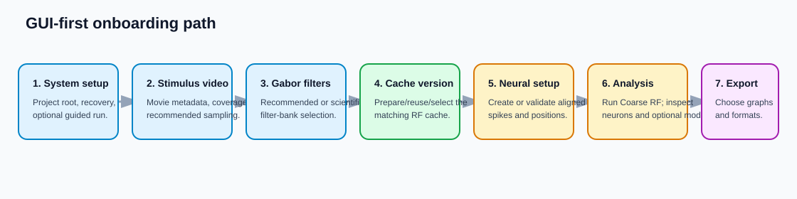

# GUI Onboarding

This is the primary way to run WavEn. Feel free to enter your experiment settings in the GUI
as you read this guide, and save `pipeline_config.json` only when you want a
restorable snapshot of those choices. If you prefer a JSON-first workflow, use
[Restore GUI Settings](../how-to/prepare-configuration.md); the field meanings
there are the same as the descriptions below.

!!! note "Screenshot blueprint: whole application"
    Insert a wide screenshot of the launched application here. Mark the four
    stage groups: **Prepare Coarse RF**, **Session Setup**, **Analysis**, and
    **Export**. Add numbered callouts 1–7 matching the sequence on this page.

## 1. System Configuration

Set the experiment root first. The remaining sections use its conventional
input, cache, and output folders as defaults.

!!! note "Screenshot blueprint: System Configuration"
    Show Recovery & Resume, Project Root Folder, Load/Save
    `pipeline_config.json`, Performance & Hardware, and the Guided Pipeline
    button with its export checkboxes.

### Project Root Folder

This is the root for `input/`, `cache/`, and `output/`. Set this folder ideally in an NVME SSD or at least any SSD. USB peripherals
may cause read/write bottlenecks, however, so ensure the used disk drive is ideally installed as an internal system drive.

### Recovery Checkpoint Directory

If you set `Project Root Folder` above, this field auto-updates to point to the `output/` subfolder, if you recall from the [First GUI Analysis](first-gui-analysis.md) section. Otherwise, you can hardcode a specific desired recovery folder path. In both cases, the program
will populate either folder with the same subfolders and files.

### Save / Load `pipeline_config.json`

Optional convenience for saving or loading the input configurations of a known-good session. It is not required to enter or run an experiment.

### Performance & Hardware

Multiple features here tend to speedup the code tremendously. For safety, all these features have fallbacks in case they fail.

- **RAM acceleration cache (later analysis):** Keeps safely sized, repeatedly used model-phase and PSTH/STA arrays in memory to accelerate later analysis. Large arrays remain disk-backed automatically.

- **Use compatible GPUs:** Enables parallel convolution across multiple CUDA GPUs only when their capabilities are sufficiently compatible. Incompatible or substantially slower GPUs are excluded to avoid slowing the run. The hardware status text at the bottom of this panel reports whether CUDA GPUs are detected and whether multi-GPU processing can have any effect on the current computer.

- **Compile stable convolution kernels (experimental):** Uses torch.compile after a one-time warm-up to optimize repeated convolution operations. If compilation fails, processing falls back safely to normal execution. Apparently, this is only supported on Linux systems.

- **Tensor Core convolution (fast precision):** Uses CUDA float16 autocasting for wavelet convolution on supported GPUs. Coarse-RF statistics retain their existing precision.

- **Release RAM acceleration cache:** Immediately frees arrays held by the optional RAM cache without changing whether the RAM-cache option is enabled for future work.

### Automate Guided Coarse RF Pipeline

After configuring all the experimental configurations the stimulus, neural data source, visual coverage, sampling, Gabor filter bank, cache folders, and export selections throughout the GUI, use this section to **automate** "clicking the buttons" in the GUI.

The automated pipeline prepares the stimulus cache, validates or creates the neural cache, builds the Coarse RF cache, and runs Coarse RF analysis. Optionally, it can export the all-neuron and individual-neuron graphs selected in the Export section after analysis completes. Review and save your pipeline_config.json before running, especially when creating a new cache version or processing a large dataset.

## 2. Stimulus Video

Choose the movie, define its visual extent, then choose the analysis visual coverage.
The GUI reads movie width, height, frame count, and FPS automatically from metadata.

!!! note "Screenshot blueprint: Stimulus Video"
    Show the Stimulus Movie Folder path at the top, Visual Field Coverage and
    Analysis Field Coverage together, sampling-mode choices, the derived grid /
    Nyquist status, and Prepare Stimulus Cache.

| Input | Input type | Output | Output type | Relevance and configuration |
| --- | --- | --- | --- | --- |
| Stimulus Movie Folder | Directory containing one intended movie | Movie metadata | Width, height, frames, FPS | This is the source of truth for time and pixel dimensions. Keep the folder unambiguous. |
| Visual Field Coverage | `[left, right, top, bottom]` in degrees | Pixel-to-angle mapping | Calibration values | The angular extent of the full movie. Use the stimulus display's measured bounds. |
| Analysis Field Coverage | Same four-number order, inside Visual Field Coverage | Cropped analysis field | Derived spatial grid | Limits the visual field analysed. Changing it changes dependent stimulus and wavelet caches. |
| Sampling mode: Target degrees/pixel | Positive degrees/pixel | Analysis grid and Nyquist limit | Derived metadata | Recommended when you know the spatial resolution you need. Smaller values retain more detail and create larger caches. |
| Sampling mode: Retain up to cpd | Positive cycles/degree | Analysis grid and Nyquist limit | Derived metadata | Recommended when you know the highest meaningful spatial frequency. The GUI leaves a safety margin above Nyquist. |
| Sampling mode: Compatibility percent | Integer 1–100 | Legacy-style grid fraction | Derived metadata | Use only to reproduce a prior percentage-based grid; it has no direct visual-angle interpretation. |
| Prepare Stimulus Cache | Button | Downsampled/cropped movie | NPY or Zarr binary movie cache | Required before wavelet preparation. This stimulus cache is shared by matching cache versions. |

## 3. Gabor Filters

Set the feature bank that the cache will contain. Start from the GUI
recommendation when possible, then adjust only to answer a specific scientific
question.

!!! note "Screenshot blueprint: Gabor Filters"
    Show the physical filter-bank recommender, its minimum/maximum cpd and
    density inputs, the recommendation summary, editable Gabor fields, and
    Prepare Gabor Assets.

| Input | Input type | Output | Output type | Relevance and configuration |
| --- | --- | --- | --- | --- |
| Recommend and Apply Filter Bank | Button using movie metadata and coverage | Suggested Sigmas and Frequencies | Editable lists | Recommended starting point. It converts visual-angle sampling and a requested cpd range into a physically meaningful filter bank. |
| Orientation Count (`N_thetas`) | Positive integer | Orientation feature axis | Filter-bank axis | Number of evenly spaced orientations from 0° to 180°. Use more only when finer orientation hypotheses are necessary. |
| Sigmas | Increasing list of analysis pixels | Coarse RF scale axis | Filter-bank axis | Gaussian envelope sizes. Use a short list spanning plausible receptive-field sizes; each extra size increases cache cost. |
| Frequencies | List of cycles per analysis pixel | Frequency axis | Filter-bank axis | Use values below the displayed Nyquist limit. Required for Full Model work and optionally used by Coarse RF frequency-list mode. |
| Phases | List of degrees, normally `[0, 90]` | Real/imaginary phase information | Filter-bank axis | Quadrature-style phase offsets used by phase-aware model products. |
| Coarse RF frequency mode | Either coupled pairs or an independent list | Coarse RF feature layout | Cache identity | Coupled mode pairs each size with its corresponding frequency; independent mode evaluates every size/frequency combination and costs more. |
| Prepare Gabor Assets | Button | Compact convolution kernels | Reusable kernel cache | Build once for a matching grid and Gabor bank. Kernel preparation is much smaller than wavelet-cache preparation. |

## 4. Cache libraries and active cache versions

The cache folders are libraries. A library retains the shared downsampled
stimulus cache and can hold several named wavelet-cache versions. This is what
makes reuse across new raw neural recordings practical.

!!! note "Screenshot blueprint: Coarse RF Cache"
    Show Cache folders at the top, Active cache versions directly below,
    Prepare Analysis Caches, the optional Run Model / Full Model checkboxes,
    cache-size estimate, and the replacement dialog showing Yes / No / Cancel.

| Input | Input type | Output | Output type | Relevance and configuration |
| --- | --- | --- | --- | --- |
| Coarse RF Cache Library Folder | Directory | Coarse cache library | Folder containing shared stimulus + cache versions | The parent folder for Coarse RF products. Leave at the project default unless cache storage belongs elsewhere. |
| Full-Model Cache Library Folder | Directory | Full Model cache library | Folder containing phase-cache versions | Used only for optional Full Model phase products. |
| Active Coarse RF Cache | Dropdown of completed cache folders | Selected analysis source | One cache-version folder | Choose the cache version used by **Run Coarse RF Analysis**. The GUI validates its movie, crop, grid, and Gabor provenance before analysis. |
| Active Full Model Cache | Dropdown of completed cache folders | Selected model source | One cache-version folder | Choose the phase-cache version used by optional Full Model inspection. |
| Prepare Analysis Caches | Button | Coarse RF power cache | Zarr feature store | Builds or reuses `coarse_rf_power.zarr`, the required feature cache for Coarse RF analysis. |
| Prepare Run Model Phase Caches | Checkbox | Coarse real/imaginary phase pair | Two Zarr stores | Select only when you want optional Run Model graphs after basic Coarse RF inspection. |
| Prepare Run Full Model Phase Caches | Checkbox | Full real/imaginary phase pair | Two Zarr stores | Select only when you want Full Model graphs; this is the largest optional preparation. |
| Replacement dialog: Yes | Choice | Updated selected cache version | Rebuilt cache products | Allows replacement only in the currently selected version. |
| Replacement dialog: No | Choice | New timestamped cache version | New folder under the library | Recommended when settings changed and you want to keep the prior cache. The old cache remains selectable. |

Reuse a cache only when the stimulus video, visual/analysis coverage, derived
sampling grid, Gabor orientations, sigmas, frequencies, phases, and frequency
mode match. New raw neural data is compatible with an existing stimulus-side
cache when those conditions remain true. See [Reusable Caches](../reference/storage.md)
for the complete rule and storage map.

## 5. Session Setup: create or validate neural data

Choose whether you have fresh raw data or an already aligned neural cache.
The source choice changes which path is used; it does not change the selected
stimulus-side cache.

!!! note "Screenshot blueprint: Session Setup"
    Show Fresh / raw data versus Continue / existing cache, Raw Data Folder,
    Neural Cache Folder, modality-specific fields, and the Create or Validate
    neural-cache action.

| Input | Input type | Output | Output type | Relevance and configuration |
| --- | --- | --- | --- | --- |
| Fresh / raw data | Radio choice | New aligned neural cache | `spikes` + `pos` arrays | Choose for a new recording. WavEn aligns neural activity to the movie frame axis. |
| Continue / existing cache | Radio choice | Validated existing neural cache | Disk-backed `spikes` + `pos` arrays | Choose when a matching aligned pair already exists; raw-data alignment is skipped. |
| Raw Data Folder | Directory | Raw-data source for alignment | Ephys or 2-photon files | Required only for fresh alignment. Use the layouts described in [First GUI Analysis](first-gui-analysis.md). |
| Neural Cache Folder | Directory | Aligned neural cache location | NPY or Zarr arrays | Receives fresh `spikes`/`pos` output or contains the existing pair to validate. |
| Resolution and Number of Planes | Positive number and integer | Two-photon position scaling and plane validation | Alignment settings | Required for fresh 2-photon data. The requested number of Suite2p planes must exist. |
| Sampling Rate and Photodiode Port | Positive Hz and non-negative integer | Ephys frame-bin alignment | Alignment settings | Required for fresh ephys data. Use **Find ports**, then confirm the port from wiring. |
| Create / Validate Neural Cache | Button | Frame-aligned neural response arrays | `spikes` `(trials, frames, neurons)` and `pos` | Produces or verifies the neural inputs consumed by Coarse RF analysis. |

## 6. Analysis and inspection

Analysis combines the selected compatible Coarse RF cache with the aligned
neural cache. It does not search arbitrary folders for a better cache; select
the intended version first in **Active Coarse RF Cache**.

!!! note "Screenshot blueprint: Analysis"
    Show Analysis Results Folder at the top, Run Coarse RF Analysis, the
    resulting all-neuron and individual-neuron views, then the optional model
    controls with their explanatory labels.

| Input | Input type | Output | Output type | Relevance and configuration |
| --- | --- | --- | --- | --- |
| Analysis Results Folder | Directory | Saved analysis/plot cache | Disk files | Keeps reusable GUI result state separate from stimulus and neural input caches. |
| Run Coarse RF Analysis | Button | RF correlations, preferred features, plots | Analysis state + figures | Requires a validated neural cache and a selected compatible `coarse_rf_power.zarr`. |
| Inspect Single Neuron | Neuron index + button | Per-neuron RF, tuning, and PSTH-weighted STA views | Figures | Uses the existing Coarse RF result; it does not rerun population analysis. |
| Also run Run Model tuning curves | Checkbox | Amplitude, phase, and drift curves | Additional figures | Requires the selected Coarse cache version's real/imaginary Run Model phase pair. |
| Also run Full Model | Checkbox | Full-resolution tuning curves | Additional figures | Requires the selected Full Model phase-cache version. |
| Model Evaluation Settings | Text/list/boolean fields | Model train/test behavior | Fit settings | Only affects optional model fitting. The labels explain save location, sigma list, fitting duration, trial split, and holdout behavior. |

## 7. Export

Set a persistent export folder once, choose the desired graph types, then write
files without another save-location prompt.

!!! note "Screenshot blueprint: Export"
    Show Export folder at the top, All Neurons and Individual Neurons scopes,
    file-format choices, and Repeat selections for every analyzed neuron.

| Input | Input type | Output | Output type | Relevance and configuration |
| --- | --- | --- | --- | --- |
| Export folder | Writable directory | All requested exports | Files in one folder | Set once at the top of Export. The GUI does not ask again for a save location. |
| All Neurons selections | Graph-type checkboxes | Population graphs | PNG, SVG, and optional PKL | Exports selected current all-neuron figures. |
| Individual Neurons selections | Graph-type checkboxes | Current-neuron graphs | PNG, SVG, and optional PKL | Exports selected panels for the displayed neuron. |
| Repeat selections for every analyzed neuron | Checkbox | Repeated individual-neuron exports | One set per analysed neuron | Explicitly rerenders the selected individual graphs for every analysed neuron. |
| PNG / SVG / PKL | File-format checkboxes | Exported graphs and optional data | Raster, vector, trusted Python payload | PNG is presentation-ready; SVG is editable; PKL can be much larger and is for trusted Python reuse. |

The Guided Pipeline's export checkboxes use these same Export-tab selections.
For filenames, overwrite behavior, and format trade-offs, see
[Export Results](../how-to/export-results.md).

## Optional: restore this GUI setup later

When the GUI is configured and working, choose **Save `pipeline_config.json`**
to preserve the current paths, dropdowns, checkboxes, and fields. Load it later
with **Load `pipeline_config.json`**. This is a settings backup, not the normal
way to enter a new experiment.

Next: [Restore GUI Settings (`pipeline_config.json`)](../how-to/prepare-configuration.md),
or return to [Reusable Caches](../reference/storage.md) when planning reuse.
